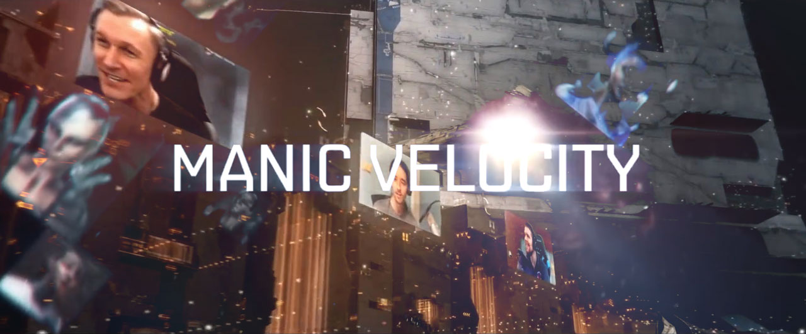
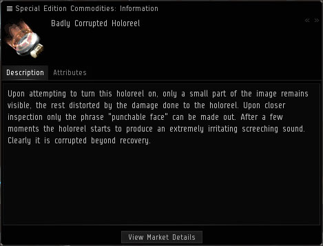

**TL;DR - You've all helped me to fulfill a childhood dream. It didn't happen exactly as I thought it would, but it's exactly what I hoped for. Thank you so much.**

These last three years have been the most eventful of my life so far. I bought a car, a house, travelled across the US and to Iceland (twice). I celebrated birthdays and anniversaries, and mourned the losses of friends and family. I met one of my childhood idols. I learned new skills that have served me personally and professionally. And somewhere along the way, I became an EVE celebrity while being mediocre at best at actually playing the game.

I started streaming in 2015 as a joke, because the concept of streaming video games was kind of bizarre to me, and I wanted to poke fun at it. I like deconstructing things and finding bits of humor in the rubble. But I think most people would agree that EVE is not the most fun game to watch.

So I started thinking up ways to make an EVE stream more active and more engaging. I started making the kind of content that I would want to watch. I conducted satirical mock-interviews with other notable EVE players (voiced by me) surrounding the latest in-game drama or scandal. I recorded commercials for low-budget goods and services that might exist in the EVE universe; the kind of stuff that you would find advertised in the bottom corner on the last page of a tabloid rather than on a holographic billboard in a space station. Sometimes I played the role of the [stooge](https://en.wikipedia.org/wiki/Farce) between an off-camera A/V engineer working behind the scenes, and a short-tempered duplicate version of myself who would appear on screen to berate for me doing something wrong.

All the while I made a point to be as immediately responsive as possible to the viewers in the chat. No delay. No "opsec" covering portions of the game. The whole point was to encourage people to actually *watch* the stream. Turns out there's an audience for that kind of thing. I stuck to a regular schedule of streaming for two hours a night, one night a week. When that week's show was over, I'd start thinking up ideas and writing scripts for the next week.

I started getting asked to make content for other players and participate in EVE events. I was asked to co-host the livestream for EVE Vegas 2016 alongside Rahne and Bam Stroker, and I was accepted to give a [presentation](https://www.youtube.com/watch?v=6X_LNrQqCOk) on finding one's place in the EVE community. I was pulled up on stage to [sing with Permaband](https://www.youtube.com/watch?v=fJ1P3NJCgAM) that year.

At some point I was dubbed *"The most punchable face in New Eden"*, which now appears on billboards in stations across the game.

Then in February of 2017 I had a conversation with CCP Guard, and he asked if I was going to be at Fanfest that year. He said he had a plan to bring a player on stage to co-host the opening ceremony with him. It was the first time CCP had ever done anything like this. And in my naivete', not picking up on the obvious hint, I began giving him a list of players who I felt would be a good fit for the idea.

> *"Actually... we want you to do it."*

And it all kind of snowballed from there. I kept a positive attitude and just kept saying "yes" when asked if I wanted to do something. It was all very surreal.

In 2018 I was invited back to Fanfest along with the [Streamfleet](http://streamfleet.org) team to co-host EVE TV with [Rahne, Zarvox, and Bjorn Bee](https://www.youtube.com/watch?v=_fPOVoyknUc) for EVE's 15th anniversary. If I had my way, the four of us would host every EVE TV broadcast. I continued to do my show, recording new commercials, doing new fake interviews, and overall tried my best to come up with new video content. I brought my wife along to EVE Vegas this year and she became something of a celebrity herself.

But now that 2019 is rolling around, I've been feeling the need to take a break. I have other projects that I want to work on, other games that I want to play, and I can't do all of it when I'm always focusing on my next show, or coming up with ideas for a new video.

These last three years have been an incredible journey of self-discovery. Or, I guess "self re-discovery" is more appropriate. While talking about it with Mrs. Velocity a few nights ago, I realized that this is what I've wanted to do since I was a kid. I've always enjoyed making people laugh, and when I was little I wanted to grow up to be an actor. I would spend hours in my room with a cassette player, recording myself doing goofy voices and comedy sketches. I was the class clown in school and spent many an afternoon in the principal's office. I took theater classes every year in junior high and high school, and fell in love with improv. My best friend and I produced our own pre-recorded radio shows that we made available on our website, years before "podcasting" was a thing. I knew that performing was what I was meant to do.

The EVE Online community has helped me remember something about myself that I had forgotten, and for that I am eternally grateful. I'm not starring in movies or doing stand-up at Carnegie Hall, but I do have my own in-game vanity item, and that's good enough for me.

