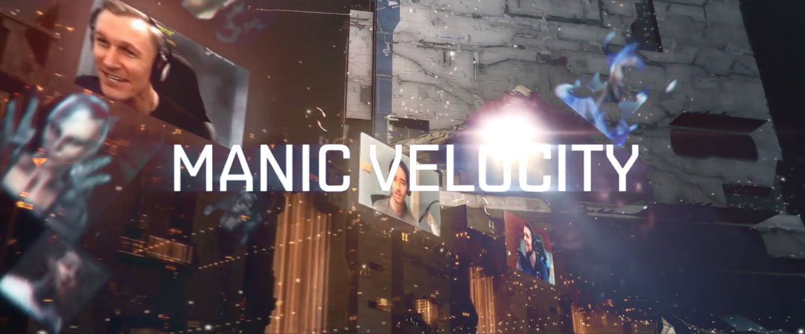
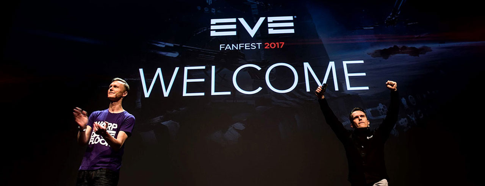
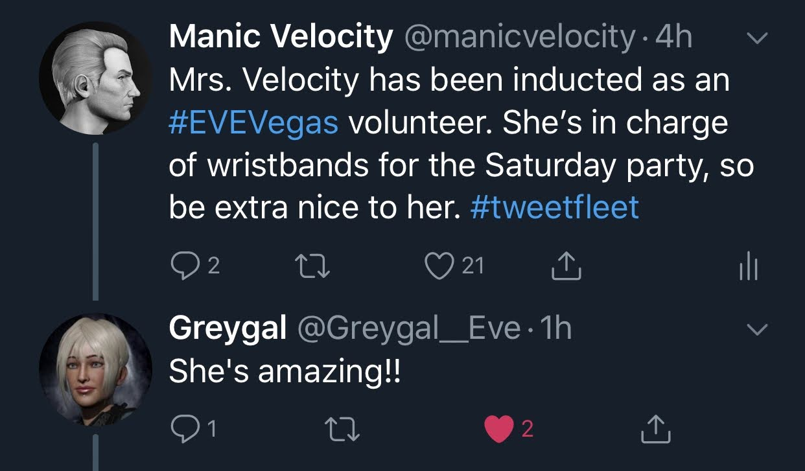
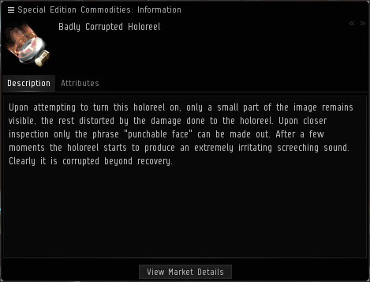

**TL;DR - You've all helped me to fulfill a childhood dream. It didn't happen exactly as I thought it would, but it's exactly what I hoped for. Thank you so much.**

These last three years have been the most eventful of my life so far. I bought a car, a house, travelled across the US and to Iceland (twice). I celebrated birthdays and anniversaries, and mourned the losses of friends and family. I met one of my childhood idols. I learned new skills that have served me personally and professionally. And somewhere along the way, I became an "EVE celebrity" while being average at best at actually playing the game.

I started streaming in 2015 because the concept of streaming video games was kind of bizarre to me, and I wanted to poke fun at it. I like deconstructing things and finding bits of humor in the rubble. But I think most people would agree that EVE is not the most fun game to watch.

So I started thinking up ways to make an EVE stream more active and engaging. I started making the kind of content that I would want to see. I conducted satirical [mock-interviews](https://www.youtube.com/watch?v=Xx7ixuHP7JA) with other notable EVE players (voiced by me) surrounding the latest in-game drama or scandal. I recorded commercials for [low-budget goods and services](https://www.youtube.com/watch?v=iOG6jnG7UiY) that might exist in the EVE universe; the kind of stuff you would find advertised in the bottom corner on the last page of a tabloid, rather than on a holographic billboard in a space station. Sometimes I played the [stooge](https://en.wikipedia.org/wiki/Farce) between an off-camera A/V engineer, and a short-tempered [duplicate version of myself](https://www.youtube.com/watch?v=98DP9UAgexw) who would appear on screen to berate for me doing something wrong. I structured the stream like a weekly TV show.

<video width="100%" height="auto" autoplay controls loop>
    <source src="https://i.imgur.com/aoPanYJ.mp4" type="video/mp4">
</video>

All the while I made a point to be as immediately responsive as possible to the viewers in the chat. No stream delay. No "opsec" obscuring portions of my screen. The whole point was to encourage people to actually *watch* the stream, and not just listen to it in the background. I stuck to a regular schedule of streaming for two hours a night, one night a week. As soon as that week's show was over, I'd start thinking up ideas and writing scripts for the next week. Always moving forward.

What began as a casual way for me to have some fun at the expense of EVE quickly turned into something I was putting a lot of effort into, and looking forward to producing.

I started getting asked to make content for [other players](https://www.youtube.com/watch?v=A1TvGbAJQfs), and to participate in in-game events. I was invited to co-host EVE TV for EVE Vegas 2016 alongside Rahne and Bam Stroker, and I was accepted to give a [presentation](https://www.youtube.com/watch?v=6X_LNrQqCOk) on finding one's place in the EVE community. I was pulled up on stage to [sing with Permaband](https://www.youtube.com/watch?v=fJ1P3NJCgAM) that year.

2016 saw a large induction of new streamers into EVE Online. Before then it was a pretty niche activity. The number of people streaming EVE at any given time was pretty small, because broadcasting your gameplay to the public increased your risk of becoming a target. Streaming EVE was considered a liability, and it was common for players to be denied membership to corporations and alliances if they were a known streamer. Though I feel this attitude has shifted over the years to be more inclusive.

In February of 2017 CCP Guard reached out to me and asked if I was going to be at Fanfest that year. He talked about his plan to bring a player on stage to co-host the opening ceremony with him. It was the first time CCP had ever done anything like this, and he wanted to get my thoughts on the idea. In my naivete', not picking up on the obvious hint, I began giving him a list of players who I felt would be a good fit for something like that. Folks like Lysus, Rahne, Zarvox. Y'know, some of the *big* names in EVE.

> *"Actually, we want you to do it."*

And so I was off to Iceland.

It all kind of snowballed from there. I maintained a positive attitude and just kept saying "yes" when asked if I wanted to do something. It was all very surreal. At some point I was called *"The most punchable face in New Eden"* by someone in CCP's Twitch chat. It's a title which I quickly and gladly took ownership of, and which now appears on billboards in stations across the game.

2017 also saw the founding of [Streamfleet](http://streamfleet.org) which serves as a hub for this kind of content, and the number of EVE streamers increased exponentially. People were now jumping at the chance to be part of the streamer community, bringing attention EVE, growing their audiences, developing their own brand of content, and raising thousands of dollars for charities through in-game events. Streaming EVE had reached a level of prevelance that was unheard of just two years before. 

<iframe src='https://www.youtube.com/embed/yohNmGJ_vJE' frameborder='0' allowfullscreen></iframe>

In 2018 I was invited back to Fanfest along with the Streamfleet team to co-host EVE TV with [Rahne, Zarvox, and Bjorn Bee](https://www.youtube.com/watch?v=_fPOVoyknUc) for EVE's 15th anniversary. If I had my way, the four of us would host every EVE TV broadcast.

I continued to do my weekly show, recording new commercials, doing the fake interviews, and coming up with new video content. I brought my wife along to EVE Vegas this year and she became something of a celebrity herself. 

But now that 2019 is rolling around, I've been feeling the need to take a break. I have other projects that I want to work on, other games that I want to play, and I can't do all of it when I'm always focusing on next week's show. I'll still be playing EVE, and I'll still stream when the mood is right, but I don't plan on sticking to any kind of schedule. I simply want to dedicate my time to other things for a while.

These last three years have been an incredible journey of self-discovery. Or, I guess "self re-discovery" is more appropriate. While talking about it with Mrs. Velocity a few nights ago, I realized that this is what I've wanted to do since I was a kid. I've always enjoyed making people laugh, and when I was little I wanted to grow up to be an actor. I would spend hours in my room with a cassette player, recording myself doing goofy voices and comedy sketches. I was the class clown in school and spent many an afternoon in the principal's office. I took theater classes every year in junior high and high school, and fell in love with improv. My best friend and I produced our own pre-recorded radio shows that we made available on our website, years before "podcasting" existed as a medium. I knew that performing was what I was meant to do.

The EVE Online community has helped me remember something about myself that I had forgotten, and for that I am eternally grateful. I'm not starring in movies or performing at Carnegie Hall, but I do have my own in-game vanity item, and I think that's pretty damn cool.

